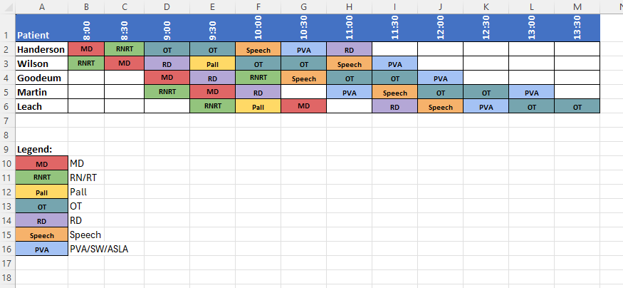

# Patient Scheduling

## Purpose
This project is an attempt to create a simple online 'scheduling' app. 
It will allow a user to open a browser, create a blank schedule, drag and drop elements into the schedule.  Once the user is satisfied, the schedule can be saved and/or printed.

## Tech Stack
- **Frontend**: Vue 3 + Vue Draggable (for drag-and-drop functionality)
- **Backend**: Python (Flask or FastAPI)
- **Storage**: JSON files initially (can upgrade to SQLite later)
- **Deployment**: Docker containerized
- **Authentication**: None initially (can add later if needed)

## Data Model

### Specialties (Basic Unit)
- Name: "MD", "RNRT", "OT", "Speech", "Pall", "RD", "PVA/SW/ASLA"
- Color: Each specialty has an assigned color
- Represents a single type of medical professional or service

### Teams (Schedulable Unit)
- Composition: 1 or more Specialties
- Duration: 30 minutes per appointment block
- Specialists in a team take turns during the appointment slot
- Examples:
  - Simple team: Just "MD" (single specialty)
  - Complex team: "MD + RNRT + OT" (multiple specialties)
- Teams are the draggable blocks placed into the schedule

## Use Cases

### Setup Phase
1. **Define Specialties**
   - User creates specialty types (MD, RNRT, OT, Speech, Pall, RD, PVA/SW/ASLA)
   - User assigns a color to each specialty

2. **Create Teams**
   - User creates teams (composition of 1+ specialties)
   - Teams become the draggable blocks for scheduling
   - Each team represents a 30-minute appointment slot

### Scheduling Phase
3. **Build Schedule**
   - User adds patient names (rows)
   - User sets time slots in 30-minute increments (columns)
   - User drags team blocks into time slots for each patient

4. **Save/Export**
   - Save completed schedule as JSON
   - Print schedule for distribution

## Key Features
- Drag-and-drop scheduling interface
- Save schedules for later editing
- Print-friendly output
- [Add other features you're planning]

## User Flow
1. User opens app in browser
2. Defines specialties and assigns colors
3. Creates teams from specialties
4. Creates blank schedule (adds patients and time slots)
5. Drags team blocks into time slots for each patient
6. Saves or prints final schedule

## Technical Considerations
- Authentication needed? (user accounts vs anonymous)
- Real-time collaboration or single-user?
- Mobile responsive?

## Deployment
- **Single Docker Container**: Simple, all-in-one deployment
  - Python backend (Flask/FastAPI) serves both API and static files
  - Built Vue app bundled as static files within the container
  - API endpoints at `/api/*`
  - Frontend served at root `/`
- Easy to deploy on any platform supporting Docker
- Can be run with a simple `docker run` command

